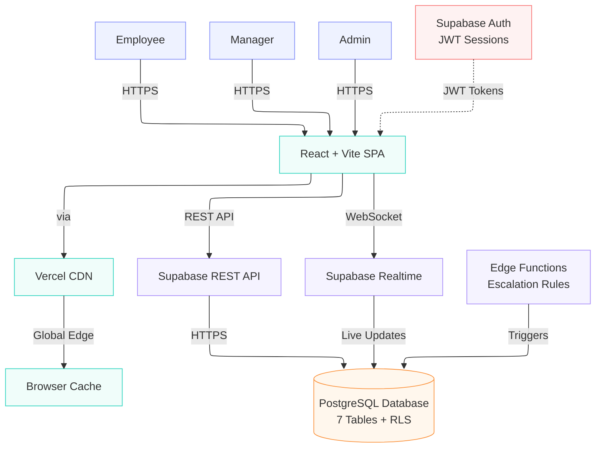

# AtomQuest Architecture Diagram

## Technology Choices & Rationale
- **React 19 + Vite**: Chosen for fast development, HMR, and optimal bundle sizes.
- **Supabase**: Chosen for speed of implementation. By providing Auth, a PostgreSQL database, and an auto-generated API in one package, it eliminates the need to build a custom Node.js/Express backend from scratch.
- **Tailwind CSS v4**: Utility-first CSS allows for rapid, consistent styling and easy responsiveness.
- **Recharts**: Lightweight and customizable charting library used for the Analytics dashboard.

## Cost Optimisation Strategy
- **Hosting**: The frontend can be hosted statically (e.g., on Vercel or Netlify) for free or at very low cost.
- **Database**: Supabase's generous free tier covers the entire scope of the hackathon, minimizing overhead.
- **API Calls**: Instead of making multiple calls for related data, we use Supabase's joined queries (e.g., fetching Goal Sheets + Goals + Achievements in a single request) to optimize network bandwidth and cost.